# code-fest-2025

## Project Intro

## 🗂️ Repository Structure

| Folder | Purpose |
|---------|----------|
| **/app/** | Main codebase — includes scripts and logic for data processing (our simple API). |
| **/data/** | Shared and stored data sets |
| **/images/** | Diagrams, screenshots, or outputs generated by the project. Used in README or presentation slides. |
| **/notes/** | Jupyter NoteBooks with Data retrival, cleaning, and model. |
| **README.md** | Main documentation (project overview, architecture, and how to run). |


## 🏗️ Architecture Overview

Below are the three key diagrams that describe the system’s design.

### 1️⃣ System Diagram
<p align="center">
  
</p>

### 2️⃣ Data & Scoring Flow
<p align="center">
  
</p>

### 3️⃣ Deployment Overview
<p align="center">
  
</p>

---

### 🧱 Modularity & Composability
- **Layers:** UI (React) → API (FastAPI) → Data (Postgres + File Storage) → Model (`scoring_model.py`)
- **Design:** Each layer is isolated — frontend handles presentation, backend handles logic, and the model runs scoring separately.
- **Reusable components:** CSV outputs and data loaders can be swapped for future APIs or database integrations.
- **Organization:**  
  `/app/` → API + model logic  
  `/data/` → clean inputs/outputs  
  `/images/` → architecture diagrams  
  `/notes/` → analysis + exploration notebooks  

---

### ⚙️ Technology Choices
- **Frontend:** React + Vite (lightweight, modular, responsive)  
- **Backend:** FastAPI (Python 3, async, type-safe, easy to deploy)  
- **Database:** Postgres SQL (structured storage for hotels & restaurants)  
- **External API:** Yelp Fusion API (real restaurant data)  
- **Environment:** `.env` for secrets and config variables  

---

### 🔐 Security
- API keys stored in `.env` → never exposed to frontend  
- Input validated with **Pydantic** models in FastAPI  
- **CORS** limited to approved frontend origin  
- Database user has restricted privileges (read/write to one schema)  
- **HTTPS** enforced when deployed  

---

### ⚡ Scalability
- **Stateless** FastAPI backend (easy horizontal scaling)  
- **Batch processing** for scoring model → fast API lookups  
- **Pagination** & **top-K results** limit payload size  
- Future option: add **Redis cache** for repeated queries  
- Designed for deployment on **Render / Railway / Docker**
- With more available data the model can be ran for other cities

---

### 📡 Data / Content Streaming
- Current mode: **batch → serve** (pre-computed model outputs)  
- Can extend to **real-time updates** using SSE or WebSocket  
- Data pipelines already modular for cloud job scheduling  

---

### 🎨 AX / CX / UI
- **User flow:**  
  1. Select preferences (radius, price, cuisines, weights)  
  2. View ranked hotels  
  3. Expand a hotel → see top-5 restaurant recommendations  
- **Design focus:** Clear cards, icons for distance/rating, simple slider inputs  
- **Error handling:** Empty-state messages & loading skeletons for better UX  

---

### 🧪 API Endpoints (Example)
```text
GET  /api/hotels/top?limit=5
GET  /api/hotels/{hotel_id}/restaurants?top_k=5
POST /api/score/preview   # body: { radius_m, price_levels, cuisines, weights }
GET  /health
```

---

