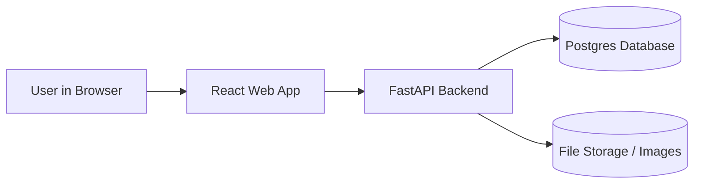

# code-fest-2025

## Project Intro

## 🗂️ Repository Structure

| Folder | Purpose |
|---------|----------|
| **/app/** | Main codebase — includes scripts and logic for data processing (our simple API). |
| **/data/** | Shared datasets used for analysis. Only small CSV or JSON files go here. Large or private data is stored in Google Drive (link in Notes). |
| **/images/** | Diagrams, screenshots, or outputs generated by the project. Used in README or presentation slides. |
| **/notes/** | Team notes, brainstorming documents, or setup instructions. Everyone can drop planning files here. |
| **README.md** | Main documentation (project overview, architecture, and how to run). |

## 🏗️ Architecture Overview

### 🧭 System Diagram

### 🧠API

Our 'app/main.py' script serves as a simple API:
- It loads datasets from '/data/'
- It filters data by user input (e.g., state name)
- It prints or returns results for analysis
